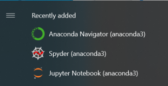

# Machine Learning in Finance with Python - Part 1: Introduction to Python
[](https://creativecommons.org/licenses/by-nc-sa/4.0/)
[](https://mybinder.org/v2/gh/richardfoltyn/MLFP-ECON5130/main?filepath=index.ipynb)

Author: Richard Foltyn, University of Glasgow

## Units

This introductory course consists of several units. Each unit corresponds
to one interactive Jupyter notebook, which is also available
as a static PDF file. Alternatively, you can download the entire course as a 
**[single PDF](latex/MLFP-part1.pdf)**.

1. Language and NumPy basics [[PDF](latex/unit01.pdf)] [](https://colab.research.google.com/github/richardfoltyn/MLFP-ECON5130/blob/main/lectures/unit01.ipynb)
2. Control flow and list comprehensions [[PDF](latex/unit02.pdf)]  [](https://colab.research.google.com/github/richardfoltyn/MLFP-ECON5130/blob/main/lectures/unit02.ipynb)
3. Reusing code - Functions, modules and packages [[PDF](latex/unit03.pdf)]  [](https://colab.research.google.com/github/richardfoltyn/MLFP-ECON5130/blob/main/lectures/unit03.ipynb)
4. Plotting [[PDF](latex/unit04.pdf)]  [](https://colab.research.google.com/github/richardfoltyn/MLFP-ECON5130/blob/main/lectures/unit04.ipynb)
5. Advanced NumPy [[PDF](latex/unit05.pdf)]  [](https://colab.research.google.com/github/richardfoltyn/MLFP-ECON5130/blob/main/lectures/unit05.ipynb)
6. Random number generation and statistics [[PDF](latex/unit06.pdf)]  [](https://colab.research.google.com/github/richardfoltyn/MLFP-ECON5130/blob/main/lectures/unit06.ipynb)
7. Handling data with pandas [[PDF](latex/unit07.pdf)]  [](https://colab.research.google.com/github/richardfoltyn/MLFP-ECON5130/blob/main/lectures/unit07.ipynb)
8. Data input and output [[PDF](latex/unit08.pdf)]  [](https://colab.research.google.com/github/richardfoltyn/MLFP-ECON5130/blob/main/lectures/unit08.ipynb)
9. Error handling (optional) [[PDF](latex/unit09.pdf)]  [](https://colab.research.google.com/github/richardfoltyn/MLFP-ECON5130/blob/main/lectures/unit09.ipynb)


The *launch binder* link at the top to start an interactive
notebook.

***

## Installation

### Running without installation

You have two options to run these notebooks directly in the cloud:

1.  Click on the  button
    above to use the notebooks directly in your web browser. It will take
    a while to create a Python environment in the cloud, but you can
    access all Python modules and data files in the repository.
2.  Click on the 
    icon next to each notebook. This will immediately open the notebook
    in [Google Colab](https://colab.research.google.com), but you need
    a Google account to run anything and importing custom modules will not work.

### Running locally

#### Download the repository contents

If you are familiar with git, clone the repository:
```bash
git clone https://github.com/richardfoltyn/MLFP-ECON5130.git
```
Otherwise, download the contents as a ZIP file by clicking on
 above.

#### Install Anaconda

On Windows, you need to install a local Python environment such as 
[Anaconda](https://www.anaconda.com/products/individual). On Linux,
your distribution comes with Python but the required packages are most likely
outdated, so it is still recommended installing Anaconda.

##### Windows

Once Anaconda is installed, click on _Jupyter Notebook_ in the Start menu
and navigate to where you extracted the repository contents. Select
`index.ipynb` to run the main notebook.



##### Linux

You need to create a new Python environment which contains all the 
required packages. You can use the specification provided in [environment.yml](environment.yml)
to accomplish that:
```bash
conda env create -f environment.yml
```
Activate the virtual environment you just created:
```bash
conda activate python-statistics
```
To start the Jupyter notebook server, navigate to where you extracted
the repository contents and run
```bash
cd path/to/repository
jupyter notebook index.ipynb
```


***

## Licence

This material is licensed under a 
[Creative Commons Attribution-NonCommercial-ShareAlike 4.0 International License](http://creativecommons.org/licenses/by-nc-sa/4.0/),
except for the data files contained in the `data/` folder, which
fall under the terms imposed by the original content creators.

## Credits

Special thanks go to Jonna Olsson for reading through all units and
suggesting various improvements.
